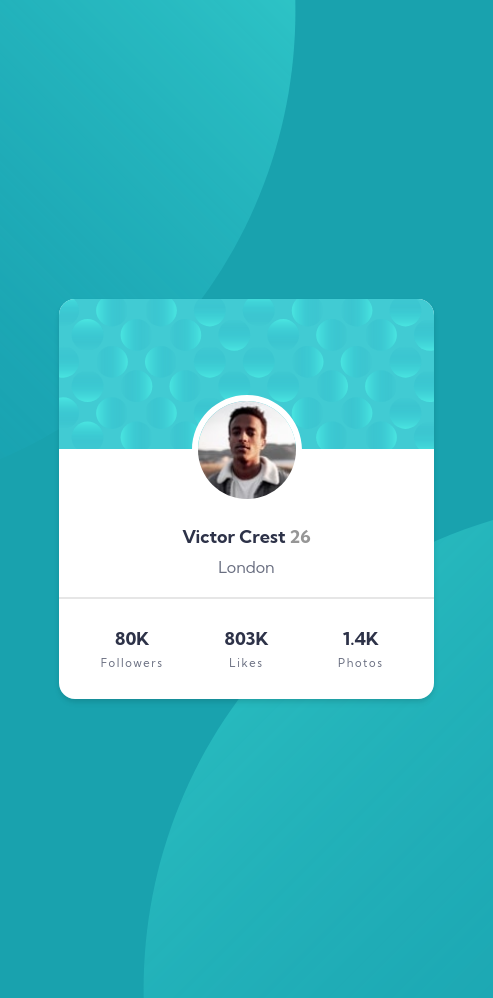
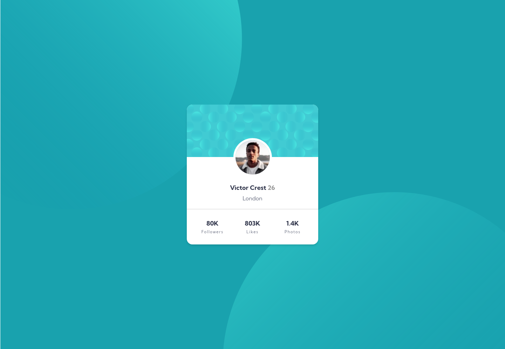

# Frontend Mentor - Profile card component solution

This is a solution to the [Profile card component challenge on Frontend Mentor](https://www.frontendmentor.io/challenges/profile-card-component-cfArpWshJ). Frontend Mentor challenges help you improve your coding skills by building realistic projects. 

## Table of contents

- [Overview](#overview)
  - [The challenge](#the-challenge)
  - [Screenshot](#screenshot)
  - [Links](#links)
- [My process](#my-process)
  - [Built with](#built-with)
  - [What I learned](#what-i-learned)
  - [Continued development](#continued-development)
  - [Useful resources](#useful-resources)
- [Author](#author)
- [Acknowledgments](#acknowledgments)

**Note: Delete this note and update the table of contents based on what sections you keep.**

## Overview

### The challenge

- Build out the project to the designs provided

### Screenshot

### Links

- Solution URL: (https://frontendmentor-profile-card-project.netlify.app/)
- Live Site URL: [Add live site URL here](https://your-live-site-url.com)

## My process

### Built with

- Semantic HTML5 markup
- CSS custom properties
- CSS Grid
- Mobile-first workflow

### What I learned

The hardest part of this challenge was to found the solution to positioning the two svg files on the background. 
The other hardest part was to disapeared the little space between the profile img and it's border. 
I didn't find solution for this problem. 
Even yet there a very thiny gap. 
If you have any idea pleas tell me.

In the next projects i would like to deep into more complex css layouts like grid, flexbox... e.t.

## Author

- Website - [Dezső Derzsi]
- Frontend Mentor - [@DeDe-code]https://www.frontendmentor.io/profile/DeDe-code

